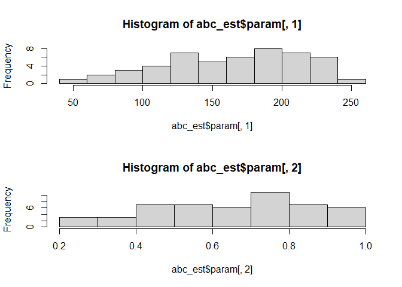
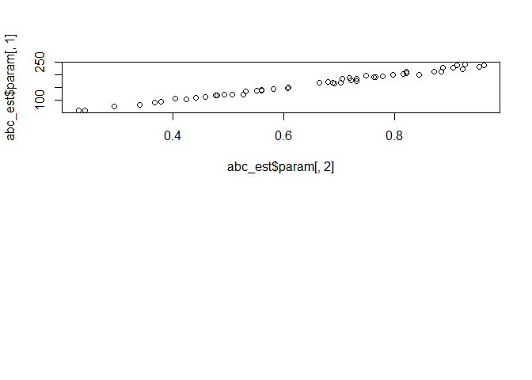

<!-- README.md is generated from README.Rmd. Please edit that file -->

# aae.pop.inference

<!-- badges: start -->
<!-- badges: end -->

`aae.pop.inference` supports inference on population dynamics models
implemented in `aae.pop`. These models are relatively complex, making
standard inference methods (e.g. maximum likelihood, MCMC) challenging,
especially as the models become realistically complex (many population
classes, temporal variability). `aae.pop.inference` uses a sequential
approximate Bayesian computation approach to support fast inference on
these complex models.

## Installation

You can install the released version of aae.pop.inference from
[GitHub](https://github.com/aae-stats/aae.pop.inference) with:

``` r
remotes::install_github("aae-stats/aae.pop.inference")
```

## Example: estimating carrying capacity and density dependence

This example uses data simulated from a model as a target to estimate
the parameters of this model. This relatively simple example (estimating
parameters of a known model) illustrates how to perform inference on
these models but also highlights a case in which the target parameters
are highly correlated.

``` r
# some packages needed
library(aae.pop)
library(aae.pop.inference)
#> Loading required package: EasyABC
#> Loading required package: abc
#> Loading required package: abc.data
#> Loading required package: nnet
#> Loading required package: quantreg
#> Loading required package: SparseM
#> 
#> Attaching package: 'SparseM'
#> The following object is masked from 'package:base':
#> 
#>     backsolve
#> Loading required package: MASS
#> Loading required package: locfit
#> locfit 1.5-9.7    2023-01-02

# define a basic population model with aae.pop
nclass <- 5
popmat <- matrix(0, ncol = nclass, nrow = nclass)
popmat[transition(popmat)] <- c(0.3, 0.5, 0.7, 0.8)
popmat[reproduction(popmat)] <- c(0, 1, 4, 10)
dd <- density_dependence(
  funs = ricker(100, exclude = 1),
  masks = reproduction(popmat)
)
pop_fn <- dynamics(matrix = popmat, dd)

# simulate some data from this model to use as a target data set
obs <- simulate(
  pop_fn,
  nsim = 1000,
  args = list(density_dependence = list(theta = 0.4))
)

# define wrapper so we can simulate from the model based on
#   the inference parameters alone
popsim_fn <- function(par) {

  tmp <- update(
    pop_fn,
    density_dependence(
      funs = ricker(par[1], exclude = 1),
      masks = reproduction(popmat)
    )
  )

  sim <- simulate(tmp, nsim = 100, args = list(density_dependence = list(theta = par[2])))

  stat_abundance_trend(sim)

}

# calculate the target from the simulated data set
target <- stat_abundance_trend(obs)

# estimate parameters by comparing the simulation model to
#   the simulated data set with uniform priors on 
#   carrying capacity (U[50, 500]) and the theta parameter
#   of the Ricker density dependence (U[0.01, 1])
abc_est <- inference(
  model = popsim_fn,
  prior = list(
    c("unif", 50, 500),
    c("unif", 0.01, 1)
  ),
  target = target,
  nb_simul = 100
)
#> [1] "    ------ Lenormand et al. (2012)'s algorithm ------"
#> [1] "step 1 completed"
#>   |                                                          |                                                  |   0%   |                                                          |=                                                 |   2% Time elapsed: 00:00:00 Estimated time remaining: 00:00:11  |                                                          |==                                                |   4% Time elapsed: 00:00:00 Estimated time remaining: 00:00:11  |                                                          |===                                               |   6% Time elapsed: 00:00:00 Estimated time remaining: 00:00:10  |                                                          |====                                              |   8% Time elapsed: 00:00:00 Estimated time remaining: 00:00:10  |                                                          |=====                                             |  10% Time elapsed: 00:00:01 Estimated time remaining: 00:00:10  |                                                          |======                                            |  12% Time elapsed: 00:00:01 Estimated time remaining: 00:00:10  |                                                          |=======                                           |  14% Time elapsed: 00:00:01 Estimated time remaining: 00:00:09  |                                                          |========                                          |  16% Time elapsed: 00:00:01 Estimated time remaining: 00:00:09  |                                                          |=========                                         |  18% Time elapsed: 00:00:02 Estimated time remaining: 00:00:09  |                                                          |==========                                        |  20% Time elapsed: 00:00:02 Estimated time remaining: 00:00:08  |                                                          |===========                                       |  22% Time elapsed: 00:00:02 Estimated time remaining: 00:00:08  |                                                          |============                                      |  24% Time elapsed: 00:00:02 Estimated time remaining: 00:00:08  |                                                          |=============                                     |  26% Time elapsed: 00:00:02 Estimated time remaining: 00:00:08  |                                                          |==============                                    |  28% Time elapsed: 00:00:03 Estimated time remaining: 00:00:08  |                                                          |===============                                   |  30% Time elapsed: 00:00:03 Estimated time remaining: 00:00:08  |                                                          |================                                  |  32% Time elapsed: 00:00:03 Estimated time remaining: 00:00:08  |                                                          |=================                                 |  34% Time elapsed: 00:00:04 Estimated time remaining: 00:00:07  |                                                          |==================                                |  36% Time elapsed: 00:00:04 Estimated time remaining: 00:00:07  |                                                          |===================                               |  38% Time elapsed: 00:00:04 Estimated time remaining: 00:00:07  |                                                          |====================                              |  40% Time elapsed: 00:00:04 Estimated time remaining: 00:00:07  |                                                          |=====================                             |  42% Time elapsed: 00:00:04 Estimated time remaining: 00:00:06  |                                                          |======================                            |  44% Time elapsed: 00:00:05 Estimated time remaining: 00:00:06  |                                                          |=======================                           |  46% Time elapsed: 00:00:05 Estimated time remaining: 00:00:06  |                                                          |========================                          |  48% Time elapsed: 00:00:05 Estimated time remaining: 00:00:06  |                                                          |=========================                         |  50% Time elapsed: 00:00:05 Estimated time remaining: 00:00:05  |                                                          |==========================                        |  52% Time elapsed: 00:00:06 Estimated time remaining: 00:00:05  |                                                          |===========================                       |  54% Time elapsed: 00:00:06 Estimated time remaining: 00:00:05  |                                                          |============================                      |  56% Time elapsed: 00:00:06 Estimated time remaining: 00:00:05  |                                                          |=============================                     |  58% Time elapsed: 00:00:06 Estimated time remaining: 00:00:04  |                                                          |==============================                    |  60% Time elapsed: 00:00:06 Estimated time remaining: 00:00:04  |                                                          |===============================                   |  62% Time elapsed: 00:00:07 Estimated time remaining: 00:00:04  |                                                          |================================                  |  64% Time elapsed: 00:00:07 Estimated time remaining: 00:00:04  |                                                          |=================================                 |  66% Time elapsed: 00:00:07 Estimated time remaining: 00:00:03  |                                                          |==================================                |  68% Time elapsed: 00:00:07 Estimated time remaining: 00:00:03  |                                                          |===================================               |  70% Time elapsed: 00:00:08 Estimated time remaining: 00:00:03  |                                                          |====================================              |  72% Time elapsed: 00:00:08 Estimated time remaining: 00:00:03  |                                                          |=====================================             |  74% Time elapsed: 00:00:08 Estimated time remaining: 00:00:03  |                                                          |======================================            |  76% Time elapsed: 00:00:09 Estimated time remaining: 00:00:02  |                                                          |=======================================           |  78% Time elapsed: 00:00:09 Estimated time remaining: 00:00:02  |                                                          |========================================          |  80% Time elapsed: 00:00:10 Estimated time remaining: 00:00:02  |                                                          |=========================================         |  82% Time elapsed: 00:00:10 Estimated time remaining: 00:00:02  |                                                          |==========================================        |  84% Time elapsed: 00:00:10 Estimated time remaining: 00:00:02  |                                                          |===========================================       |  86% Time elapsed: 00:00:11 Estimated time remaining: 00:00:01  |                                                          |============================================      |  88% Time elapsed: 00:00:11 Estimated time remaining: 00:00:01  |                                                          |=============================================     |  90% Time elapsed: 00:00:12 Estimated time remaining: 00:00:01  |                                                          |==============================================    |  92% Time elapsed: 00:00:12 Estimated time remaining: 00:00:01  |                                                          |===============================================   |  94% Time elapsed: 00:00:13 Estimated time remaining: 00:00:00  |                                                          |================================================  |  96% Time elapsed: 00:00:13 Estimated time remaining: 00:00:00  |                                                          |================================================= |  98% Time elapsed: 00:00:14 Estimated time remaining: 00:00:00  |                                                          |==================================================| 100% Completed  in 00:00:14                                               
#> [1] "step 2 completed - p_acc = 0.64"
#>   |                                                          |                                                  |   0%   |                                                          |=                                                 |   2% Time elapsed: 00:00:00 Estimated time remaining: 00:00:18  |                                                          |==                                                |   4% Time elapsed: 00:00:00 Estimated time remaining: 00:00:19  |                                                          |===                                               |   6% Time elapsed: 00:00:01 Estimated time remaining: 00:00:21  |                                                          |====                                              |   8% Time elapsed: 00:00:01 Estimated time remaining: 00:00:21  |                                                          |=====                                             |  10% Time elapsed: 00:00:02 Estimated time remaining: 00:00:21  |                                                          |======                                            |  12% Time elapsed: 00:00:02 Estimated time remaining: 00:00:20  |                                                          |=======                                           |  14% Time elapsed: 00:00:03 Estimated time remaining: 00:00:19  |                                                          |========                                          |  16% Time elapsed: 00:00:03 Estimated time remaining: 00:00:18  |                                                          |=========                                         |  18% Time elapsed: 00:00:03 Estimated time remaining: 00:00:17  |                                                          |==========                                        |  20% Time elapsed: 00:00:04 Estimated time remaining: 00:00:16  |                                                          |===========                                       |  22% Time elapsed: 00:00:04 Estimated time remaining: 00:00:16  |                                                          |============                                      |  24% Time elapsed: 00:00:04 Estimated time remaining: 00:00:15  |                                                          |=============                                     |  26% Time elapsed: 00:00:05 Estimated time remaining: 00:00:15  |                                                          |==============                                    |  28% Time elapsed: 00:00:05 Estimated time remaining: 00:00:14  |                                                          |===============                                   |  30% Time elapsed: 00:00:05 Estimated time remaining: 00:00:13  |                                                          |================                                  |  32% Time elapsed: 00:00:06 Estimated time remaining: 00:00:13  |                                                          |=================                                 |  34% Time elapsed: 00:00:06 Estimated time remaining: 00:00:12  |                                                          |==================                                |  36% Time elapsed: 00:00:07 Estimated time remaining: 00:00:12  |                                                          |===================                               |  38% Time elapsed: 00:00:07 Estimated time remaining: 00:00:12  |                                                          |====================                              |  40% Time elapsed: 00:00:07 Estimated time remaining: 00:00:11  |                                                          |=====================                             |  42% Time elapsed: 00:00:08 Estimated time remaining: 00:00:11  |                                                          |======================                            |  44% Time elapsed: 00:00:08 Estimated time remaining: 00:00:10  |                                                          |=======================                           |  46% Time elapsed: 00:00:08 Estimated time remaining: 00:00:10  |                                                          |========================                          |  48% Time elapsed: 00:00:09 Estimated time remaining: 00:00:09  |                                                          |=========================                         |  50% Time elapsed: 00:00:09 Estimated time remaining: 00:00:09  |                                                          |==========================                        |  52% Time elapsed: 00:00:09 Estimated time remaining: 00:00:08  |                                                          |===========================                       |  54% Time elapsed: 00:00:10 Estimated time remaining: 00:00:08  |                                                          |============================                      |  56% Time elapsed: 00:00:10 Estimated time remaining: 00:00:08  |                                                          |=============================                     |  58% Time elapsed: 00:00:10 Estimated time remaining: 00:00:07  |                                                          |==============================                    |  60% Time elapsed: 00:00:11 Estimated time remaining: 00:00:07  |                                                          |===============================                   |  62% Time elapsed: 00:00:11 Estimated time remaining: 00:00:06  |                                                          |================================                  |  64% Time elapsed: 00:00:11 Estimated time remaining: 00:00:06  |                                                          |=================================                 |  66% Time elapsed: 00:00:12 Estimated time remaining: 00:00:06  |                                                          |==================================                |  68% Time elapsed: 00:00:12 Estimated time remaining: 00:00:05  |                                                          |===================================               |  70% Time elapsed: 00:00:12 Estimated time remaining: 00:00:05  |                                                          |====================================              |  72% Time elapsed: 00:00:13 Estimated time remaining: 00:00:05  |                                                          |=====================================             |  74% Time elapsed: 00:00:13 Estimated time remaining: 00:00:04  |                                                          |======================================            |  76% Time elapsed: 00:00:14 Estimated time remaining: 00:00:04  |                                                          |=======================================           |  78% Time elapsed: 00:00:14 Estimated time remaining: 00:00:04  |                                                          |========================================          |  80% Time elapsed: 00:00:14 Estimated time remaining: 00:00:03  |                                                          |=========================================         |  82% Time elapsed: 00:00:15 Estimated time remaining: 00:00:03  |                                                          |==========================================        |  84% Time elapsed: 00:00:15 Estimated time remaining: 00:00:02  |                                                          |===========================================       |  86% Time elapsed: 00:00:16 Estimated time remaining: 00:00:02  |                                                          |============================================      |  88% Time elapsed: 00:00:16 Estimated time remaining: 00:00:02  |                                                          |=============================================     |  90% Time elapsed: 00:00:16 Estimated time remaining: 00:00:01  |                                                          |==============================================    |  92% Time elapsed: 00:00:17 Estimated time remaining: 00:00:01  |                                                          |===============================================   |  94% Time elapsed: 00:00:17 Estimated time remaining: 00:00:01  |                                                          |================================================  |  96% Time elapsed: 00:00:18 Estimated time remaining: 00:00:00  |                                                          |================================================= |  98% Time elapsed: 00:00:18 Estimated time remaining: 00:00:00  |                                                          |==================================================| 100% Completed  in 00:00:18                                               
#> [1] "step 3 completed - p_acc = 0.66"
#>   |                                                          |                                                  |   0%   |                                                          |=                                                 |   2% Time elapsed: 00:00:00 Estimated time remaining: 00:00:13  |                                                          |==                                                |   4% Time elapsed: 00:00:00 Estimated time remaining: 00:00:13  |                                                          |===                                               |   6% Time elapsed: 00:00:00 Estimated time remaining: 00:00:12  |                                                          |====                                              |   8% Time elapsed: 00:00:01 Estimated time remaining: 00:00:12  |                                                          |=====                                             |  10% Time elapsed: 00:00:01 Estimated time remaining: 00:00:11  |                                                          |======                                            |  12% Time elapsed: 00:00:01 Estimated time remaining: 00:00:11  |                                                          |=======                                           |  14% Time elapsed: 00:00:01 Estimated time remaining: 00:00:11  |                                                          |========                                          |  16% Time elapsed: 00:00:02 Estimated time remaining: 00:00:10  |                                                          |=========                                         |  18% Time elapsed: 00:00:02 Estimated time remaining: 00:00:10  |                                                          |==========                                        |  20% Time elapsed: 00:00:02 Estimated time remaining: 00:00:10  |                                                          |===========                                       |  22% Time elapsed: 00:00:02 Estimated time remaining: 00:00:09  |                                                          |============                                      |  24% Time elapsed: 00:00:03 Estimated time remaining: 00:00:09  |                                                          |=============                                     |  26% Time elapsed: 00:00:03 Estimated time remaining: 00:00:09  |                                                          |==============                                    |  28% Time elapsed: 00:00:03 Estimated time remaining: 00:00:08  |                                                          |===============                                   |  30% Time elapsed: 00:00:03 Estimated time remaining: 00:00:08  |                                                          |================                                  |  32% Time elapsed: 00:00:03 Estimated time remaining: 00:00:08  |                                                          |=================                                 |  34% Time elapsed: 00:00:04 Estimated time remaining: 00:00:08  |                                                          |==================                                |  36% Time elapsed: 00:00:04 Estimated time remaining: 00:00:07  |                                                          |===================                               |  38% Time elapsed: 00:00:04 Estimated time remaining: 00:00:07  |                                                          |====================                              |  40% Time elapsed: 00:00:04 Estimated time remaining: 00:00:07  |                                                          |=====================                             |  42% Time elapsed: 00:00:05 Estimated time remaining: 00:00:07  |                                                          |======================                            |  44% Time elapsed: 00:00:05 Estimated time remaining: 00:00:06  |                                                          |=======================                           |  46% Time elapsed: 00:00:05 Estimated time remaining: 00:00:06  |                                                          |========================                          |  48% Time elapsed: 00:00:06 Estimated time remaining: 00:00:06  |                                                          |=========================                         |  50% Time elapsed: 00:00:06 Estimated time remaining: 00:00:06  |                                                          |==========================                        |  52% Time elapsed: 00:00:06 Estimated time remaining: 00:00:06  |                                                          |===========================                       |  54% Time elapsed: 00:00:06 Estimated time remaining: 00:00:05  |                                                          |============================                      |  56% Time elapsed: 00:00:07 Estimated time remaining: 00:00:05  |                                                          |=============================                     |  58% Time elapsed: 00:00:07 Estimated time remaining: 00:00:05  |                                                          |==============================                    |  60% Time elapsed: 00:00:07 Estimated time remaining: 00:00:05  |                                                          |===============================                   |  62% Time elapsed: 00:00:07 Estimated time remaining: 00:00:04  |                                                          |================================                  |  64% Time elapsed: 00:00:08 Estimated time remaining: 00:00:04  |                                                          |=================================                 |  66% Time elapsed: 00:00:08 Estimated time remaining: 00:00:04  |                                                          |==================================                |  68% Time elapsed: 00:00:08 Estimated time remaining: 00:00:04  |                                                          |===================================               |  70% Time elapsed: 00:00:08 Estimated time remaining: 00:00:03  |                                                          |====================================              |  72% Time elapsed: 00:00:09 Estimated time remaining: 00:00:03  |                                                          |=====================================             |  74% Time elapsed: 00:00:09 Estimated time remaining: 00:00:03  |                                                          |======================================            |  76% Time elapsed: 00:00:09 Estimated time remaining: 00:00:03  |                                                          |=======================================           |  78% Time elapsed: 00:00:10 Estimated time remaining: 00:00:02  |                                                          |========================================          |  80% Time elapsed: 00:00:10 Estimated time remaining: 00:00:02  |                                                          |=========================================         |  82% Time elapsed: 00:00:10 Estimated time remaining: 00:00:02  |                                                          |==========================================        |  84% Time elapsed: 00:00:11 Estimated time remaining: 00:00:02  |                                                          |===========================================       |  86% Time elapsed: 00:00:11 Estimated time remaining: 00:00:01  |                                                          |============================================      |  88% Time elapsed: 00:00:11 Estimated time remaining: 00:00:01  |                                                          |=============================================     |  90% Time elapsed: 00:00:11 Estimated time remaining: 00:00:01  |                                                          |==============================================    |  92% Time elapsed: 00:00:11 Estimated time remaining: 00:00:01  |                                                          |===============================================   |  94% Time elapsed: 00:00:12 Estimated time remaining: 00:00:00  |                                                          |================================================  |  96% Time elapsed: 00:00:12 Estimated time remaining: 00:00:00  |                                                          |================================================= |  98% Time elapsed: 00:00:12 Estimated time remaining: 00:00:00  |                                                          |==================================================| 100% Completed  in 00:00:12                                               
#> [1] "step 4 completed - p_acc = 0.58"
#>   |                                                          |                                                  |   0%   |                                                          |=                                                 |   2% Time elapsed: 00:00:00 Estimated time remaining: 00:00:10  |                                                          |==                                                |   4% Time elapsed: 00:00:00 Estimated time remaining: 00:00:09  |                                                          |===                                               |   6% Time elapsed: 00:00:00 Estimated time remaining: 00:00:09  |                                                          |====                                              |   8% Time elapsed: 00:00:00 Estimated time remaining: 00:00:10  |                                                          |=====                                             |  10% Time elapsed: 00:00:01 Estimated time remaining: 00:00:10  |                                                          |======                                            |  12% Time elapsed: 00:00:01 Estimated time remaining: 00:00:09  |                                                          |=======                                           |  14% Time elapsed: 00:00:01 Estimated time remaining: 00:00:09  |                                                          |========                                          |  16% Time elapsed: 00:00:01 Estimated time remaining: 00:00:09  |                                                          |=========                                         |  18% Time elapsed: 00:00:02 Estimated time remaining: 00:00:09  |                                                          |==========                                        |  20% Time elapsed: 00:00:02 Estimated time remaining: 00:00:09  |                                                          |===========                                       |  22% Time elapsed: 00:00:02 Estimated time remaining: 00:00:09  |                                                          |============                                      |  24% Time elapsed: 00:00:02 Estimated time remaining: 00:00:09  |                                                          |=============                                     |  26% Time elapsed: 00:00:03 Estimated time remaining: 00:00:08  |                                                          |==============                                    |  28% Time elapsed: 00:00:03 Estimated time remaining: 00:00:08  |                                                          |===============                                   |  30% Time elapsed: 00:00:03 Estimated time remaining: 00:00:08  |                                                          |================                                  |  32% Time elapsed: 00:00:03 Estimated time remaining: 00:00:07  |                                                          |=================                                 |  34% Time elapsed: 00:00:04 Estimated time remaining: 00:00:07  |                                                          |==================                                |  36% Time elapsed: 00:00:04 Estimated time remaining: 00:00:07  |                                                          |===================                               |  38% Time elapsed: 00:00:04 Estimated time remaining: 00:00:07  |                                                          |====================                              |  40% Time elapsed: 00:00:04 Estimated time remaining: 00:00:07  |                                                          |=====================                             |  42% Time elapsed: 00:00:05 Estimated time remaining: 00:00:07  |                                                          |======================                            |  44% Time elapsed: 00:00:05 Estimated time remaining: 00:00:06  |                                                          |=======================                           |  46% Time elapsed: 00:00:05 Estimated time remaining: 00:00:06  |                                                          |========================                          |  48% Time elapsed: 00:00:05 Estimated time remaining: 00:00:06  |                                                          |=========================                         |  50% Time elapsed: 00:00:06 Estimated time remaining: 00:00:06  |                                                          |==========================                        |  52% Time elapsed: 00:00:06 Estimated time remaining: 00:00:06  |                                                          |===========================                       |  54% Time elapsed: 00:00:06 Estimated time remaining: 00:00:05  |                                                          |============================                      |  56% Time elapsed: 00:00:07 Estimated time remaining: 00:00:05  |                                                          |=============================                     |  58% Time elapsed: 00:00:07 Estimated time remaining: 00:00:05  |                                                          |==============================                    |  60% Time elapsed: 00:00:07 Estimated time remaining: 00:00:05  |                                                          |===============================                   |  62% Time elapsed: 00:00:07 Estimated time remaining: 00:00:04  |                                                          |================================                  |  64% Time elapsed: 00:00:08 Estimated time remaining: 00:00:04  |                                                          |=================================                 |  66% Time elapsed: 00:00:08 Estimated time remaining: 00:00:04  |                                                          |==================================                |  68% Time elapsed: 00:00:08 Estimated time remaining: 00:00:04  |                                                          |===================================               |  70% Time elapsed: 00:00:08 Estimated time remaining: 00:00:03  |                                                          |====================================              |  72% Time elapsed: 00:00:08 Estimated time remaining: 00:00:03  |                                                          |=====================================             |  74% Time elapsed: 00:00:09 Estimated time remaining: 00:00:03  |                                                          |======================================            |  76% Time elapsed: 00:00:09 Estimated time remaining: 00:00:02  |                                                          |=======================================           |  78% Time elapsed: 00:00:09 Estimated time remaining: 00:00:02  |                                                          |========================================          |  80% Time elapsed: 00:00:09 Estimated time remaining: 00:00:02  |                                                          |=========================================         |  82% Time elapsed: 00:00:09 Estimated time remaining: 00:00:02  |                                                          |==========================================        |  84% Time elapsed: 00:00:10 Estimated time remaining: 00:00:01  |                                                          |===========================================       |  86% Time elapsed: 00:00:10 Estimated time remaining: 00:00:01  |                                                          |============================================      |  88% Time elapsed: 00:00:10 Estimated time remaining: 00:00:01  |                                                          |=============================================     |  90% Time elapsed: 00:00:11 Estimated time remaining: 00:00:01  |                                                          |==============================================    |  92% Time elapsed: 00:00:11 Estimated time remaining: 00:00:00  |                                                          |===============================================   |  94% Time elapsed: 00:00:11 Estimated time remaining: 00:00:00  |                                                          |================================================  |  96% Time elapsed: 00:00:11 Estimated time remaining: 00:00:00  |                                                          |================================================= |  98% Time elapsed: 00:00:12 Estimated time remaining: 00:00:00  |                                                          |==================================================| 100% Completed  in 00:00:12                                               
#> [1] "step 5 completed - p_acc = 0.56"
#>   |                                                          |                                                  |   0%   |                                                          |=                                                 |   2% Time elapsed: 00:00:00 Estimated time remaining: 00:00:09  |                                                          |==                                                |   4% Time elapsed: 00:00:00 Estimated time remaining: 00:00:10  |                                                          |===                                               |   6% Time elapsed: 00:00:00 Estimated time remaining: 00:00:10  |                                                          |====                                              |   8% Time elapsed: 00:00:00 Estimated time remaining: 00:00:09  |                                                          |=====                                             |  10% Time elapsed: 00:00:01 Estimated time remaining: 00:00:09  |                                                          |======                                            |  12% Time elapsed: 00:00:01 Estimated time remaining: 00:00:08  |                                                          |=======                                           |  14% Time elapsed: 00:00:01 Estimated time remaining: 00:00:08  |                                                          |========                                          |  16% Time elapsed: 00:00:01 Estimated time remaining: 00:00:08  |                                                          |=========                                         |  18% Time elapsed: 00:00:01 Estimated time remaining: 00:00:08  |                                                          |==========                                        |  20% Time elapsed: 00:00:02 Estimated time remaining: 00:00:08  |                                                          |===========                                       |  22% Time elapsed: 00:00:02 Estimated time remaining: 00:00:07  |                                                          |============                                      |  24% Time elapsed: 00:00:02 Estimated time remaining: 00:00:07  |                                                          |=============                                     |  26% Time elapsed: 00:00:02 Estimated time remaining: 00:00:07  |                                                          |==============                                    |  28% Time elapsed: 00:00:02 Estimated time remaining: 00:00:07  |                                                          |===============                                   |  30% Time elapsed: 00:00:03 Estimated time remaining: 00:00:07  |                                                          |================                                  |  32% Time elapsed: 00:00:03 Estimated time remaining: 00:00:07  |                                                          |=================                                 |  34% Time elapsed: 00:00:03 Estimated time remaining: 00:00:06  |                                                          |==================                                |  36% Time elapsed: 00:00:04 Estimated time remaining: 00:00:07  |                                                          |===================                               |  38% Time elapsed: 00:00:04 Estimated time remaining: 00:00:07  |                                                          |====================                              |  40% Time elapsed: 00:00:04 Estimated time remaining: 00:00:06  |                                                          |=====================                             |  42% Time elapsed: 00:00:04 Estimated time remaining: 00:00:06  |                                                          |======================                            |  44% Time elapsed: 00:00:04 Estimated time remaining: 00:00:06  |                                                          |=======================                           |  46% Time elapsed: 00:00:05 Estimated time remaining: 00:00:05  |                                                          |========================                          |  48% Time elapsed: 00:00:05 Estimated time remaining: 00:00:05  |                                                          |=========================                         |  50% Time elapsed: 00:00:05 Estimated time remaining: 00:00:05  |                                                          |==========================                        |  52% Time elapsed: 00:00:05 Estimated time remaining: 00:00:05  |                                                          |===========================                       |  54% Time elapsed: 00:00:05 Estimated time remaining: 00:00:05  |                                                          |============================                      |  56% Time elapsed: 00:00:06 Estimated time remaining: 00:00:04  |                                                          |=============================                     |  58% Time elapsed: 00:00:06 Estimated time remaining: 00:00:04  |                                                          |==============================                    |  60% Time elapsed: 00:00:06 Estimated time remaining: 00:00:04  |                                                          |===============================                   |  62% Time elapsed: 00:00:06 Estimated time remaining: 00:00:04  |                                                          |================================                  |  64% Time elapsed: 00:00:06 Estimated time remaining: 00:00:03  |                                                          |=================================                 |  66% Time elapsed: 00:00:07 Estimated time remaining: 00:00:03  |                                                          |==================================                |  68% Time elapsed: 00:00:07 Estimated time remaining: 00:00:03  |                                                          |===================================               |  70% Time elapsed: 00:00:07 Estimated time remaining: 00:00:03  |                                                          |====================================              |  72% Time elapsed: 00:00:07 Estimated time remaining: 00:00:03  |                                                          |=====================================             |  74% Time elapsed: 00:00:07 Estimated time remaining: 00:00:02  |                                                          |======================================            |  76% Time elapsed: 00:00:08 Estimated time remaining: 00:00:02  |                                                          |=======================================           |  78% Time elapsed: 00:00:08 Estimated time remaining: 00:00:02  |                                                          |========================================          |  80% Time elapsed: 00:00:08 Estimated time remaining: 00:00:02  |                                                          |=========================================         |  82% Time elapsed: 00:00:08 Estimated time remaining: 00:00:01  |                                                          |==========================================        |  84% Time elapsed: 00:00:08 Estimated time remaining: 00:00:01  |                                                          |===========================================       |  86% Time elapsed: 00:00:09 Estimated time remaining: 00:00:01  |                                                          |============================================      |  88% Time elapsed: 00:00:09 Estimated time remaining: 00:00:01  |                                                          |=============================================     |  90% Time elapsed: 00:00:09 Estimated time remaining: 00:00:01  |                                                          |==============================================    |  92% Time elapsed: 00:00:09 Estimated time remaining: 00:00:00  |                                                          |===============================================   |  94% Time elapsed: 00:00:10 Estimated time remaining: 00:00:00  |                                                          |================================================  |  96% Time elapsed: 00:00:10 Estimated time remaining: 00:00:00  |                                                          |================================================= |  98% Time elapsed: 00:00:10 Estimated time remaining: 00:00:00  |                                                          |==================================================| 100% Completed  in 00:00:10                                               
#> [1] "step 6 completed - p_acc = 0.44"
#>   |                                                          |                                                  |   0%   |                                                          |=                                                 |   2% Time elapsed: 00:00:00 Estimated time remaining: 00:00:08  |                                                          |==                                                |   4% Time elapsed: 00:00:00 Estimated time remaining: 00:00:08  |                                                          |===                                               |   6% Time elapsed: 00:00:00 Estimated time remaining: 00:00:09  |                                                          |====                                              |   8% Time elapsed: 00:00:00 Estimated time remaining: 00:00:08  |                                                          |=====                                             |  10% Time elapsed: 00:00:01 Estimated time remaining: 00:00:09  |                                                          |======                                            |  12% Time elapsed: 00:00:01 Estimated time remaining: 00:00:09  |                                                          |=======                                           |  14% Time elapsed: 00:00:01 Estimated time remaining: 00:00:08  |                                                          |========                                          |  16% Time elapsed: 00:00:01 Estimated time remaining: 00:00:08  |                                                          |=========                                         |  18% Time elapsed: 00:00:01 Estimated time remaining: 00:00:08  |                                                          |==========                                        |  20% Time elapsed: 00:00:02 Estimated time remaining: 00:00:08  |                                                          |===========                                       |  22% Time elapsed: 00:00:02 Estimated time remaining: 00:00:08  |                                                          |============                                      |  24% Time elapsed: 00:00:02 Estimated time remaining: 00:00:07  |                                                          |=============                                     |  26% Time elapsed: 00:00:02 Estimated time remaining: 00:00:07  |                                                          |==============                                    |  28% Time elapsed: 00:00:02 Estimated time remaining: 00:00:07  |                                                          |===============                                   |  30% Time elapsed: 00:00:03 Estimated time remaining: 00:00:07  |                                                          |================                                  |  32% Time elapsed: 00:00:03 Estimated time remaining: 00:00:07  |                                                          |=================                                 |  34% Time elapsed: 00:00:03 Estimated time remaining: 00:00:07  |                                                          |==================                                |  36% Time elapsed: 00:00:03 Estimated time remaining: 00:00:06  |                                                          |===================                               |  38% Time elapsed: 00:00:04 Estimated time remaining: 00:00:06  |                                                          |====================                              |  40% Time elapsed: 00:00:04 Estimated time remaining: 00:00:06  |                                                          |=====================                             |  42% Time elapsed: 00:00:04 Estimated time remaining: 00:00:06  |                                                          |======================                            |  44% Time elapsed: 00:00:04 Estimated time remaining: 00:00:05  |                                                          |=======================                           |  46% Time elapsed: 00:00:04 Estimated time remaining: 00:00:05  |                                                          |========================                          |  48% Time elapsed: 00:00:05 Estimated time remaining: 00:00:05  |                                                          |=========================                         |  50% Time elapsed: 00:00:05 Estimated time remaining: 00:00:05  |                                                          |==========================                        |  52% Time elapsed: 00:00:05 Estimated time remaining: 00:00:05  |                                                          |===========================                       |  54% Time elapsed: 00:00:05 Estimated time remaining: 00:00:04  |                                                          |============================                      |  56% Time elapsed: 00:00:05 Estimated time remaining: 00:00:04  |                                                          |=============================                     |  58% Time elapsed: 00:00:06 Estimated time remaining: 00:00:04  |                                                          |==============================                    |  60% Time elapsed: 00:00:06 Estimated time remaining: 00:00:04  |                                                          |===============================                   |  62% Time elapsed: 00:00:06 Estimated time remaining: 00:00:03  |                                                          |================================                  |  64% Time elapsed: 00:00:06 Estimated time remaining: 00:00:03  |                                                          |=================================                 |  66% Time elapsed: 00:00:07 Estimated time remaining: 00:00:03  |                                                          |==================================                |  68% Time elapsed: 00:00:07 Estimated time remaining: 00:00:03  |                                                          |===================================               |  70% Time elapsed: 00:00:07 Estimated time remaining: 00:00:03  |                                                          |====================================              |  72% Time elapsed: 00:00:07 Estimated time remaining: 00:00:02  |                                                          |=====================================             |  74% Time elapsed: 00:00:07 Estimated time remaining: 00:00:02  |                                                          |======================================            |  76% Time elapsed: 00:00:08 Estimated time remaining: 00:00:02  |                                                          |=======================================           |  78% Time elapsed: 00:00:08 Estimated time remaining: 00:00:02  |                                                          |========================================          |  80% Time elapsed: 00:00:08 Estimated time remaining: 00:00:02  |                                                          |=========================================         |  82% Time elapsed: 00:00:08 Estimated time remaining: 00:00:01  |                                                          |==========================================        |  84% Time elapsed: 00:00:08 Estimated time remaining: 00:00:01  |                                                          |===========================================       |  86% Time elapsed: 00:00:09 Estimated time remaining: 00:00:01  |                                                          |============================================      |  88% Time elapsed: 00:00:09 Estimated time remaining: 00:00:01  |                                                          |=============================================     |  90% Time elapsed: 00:00:09 Estimated time remaining: 00:00:01  |                                                          |==============================================    |  92% Time elapsed: 00:00:09 Estimated time remaining: 00:00:00  |                                                          |===============================================   |  94% Time elapsed: 00:00:09 Estimated time remaining: 00:00:00  |                                                          |================================================  |  96% Time elapsed: 00:00:10 Estimated time remaining: 00:00:00  |                                                          |================================================= |  98% Time elapsed: 00:00:10 Estimated time remaining: 00:00:00  |                                                          |==================================================| 100% Completed  in 00:00:10                                               
#> [1] "step 7 completed - p_acc = 0.44"
#>   |                                                          |                                                  |   0%   |                                                          |=                                                 |   2% Time elapsed: 00:00:00 Estimated time remaining: 00:00:08  |                                                          |==                                                |   4% Time elapsed: 00:00:00 Estimated time remaining: 00:00:10  |                                                          |===                                               |   6% Time elapsed: 00:00:00 Estimated time remaining: 00:00:11  |                                                          |====                                              |   8% Time elapsed: 00:00:01 Estimated time remaining: 00:00:11  |                                                          |=====                                             |  10% Time elapsed: 00:00:01 Estimated time remaining: 00:00:11  |                                                          |======                                            |  12% Time elapsed: 00:00:01 Estimated time remaining: 00:00:10  |                                                          |=======                                           |  14% Time elapsed: 00:00:01 Estimated time remaining: 00:00:10  |                                                          |========                                          |  16% Time elapsed: 00:00:01 Estimated time remaining: 00:00:10  |                                                          |=========                                         |  18% Time elapsed: 00:00:02 Estimated time remaining: 00:00:09  |                                                          |==========                                        |  20% Time elapsed: 00:00:02 Estimated time remaining: 00:00:09  |                                                          |===========                                       |  22% Time elapsed: 00:00:02 Estimated time remaining: 00:00:08  |                                                          |============                                      |  24% Time elapsed: 00:00:02 Estimated time remaining: 00:00:08  |                                                          |=============                                     |  26% Time elapsed: 00:00:03 Estimated time remaining: 00:00:08  |                                                          |==============                                    |  28% Time elapsed: 00:00:03 Estimated time remaining: 00:00:08  |                                                          |===============                                   |  30% Time elapsed: 00:00:03 Estimated time remaining: 00:00:08  |                                                          |================                                  |  32% Time elapsed: 00:00:03 Estimated time remaining: 00:00:08  |                                                          |=================                                 |  34% Time elapsed: 00:00:04 Estimated time remaining: 00:00:07  |                                                          |==================                                |  36% Time elapsed: 00:00:04 Estimated time remaining: 00:00:07  |                                                          |===================                               |  38% Time elapsed: 00:00:04 Estimated time remaining: 00:00:07  |                                                          |====================                              |  40% Time elapsed: 00:00:04 Estimated time remaining: 00:00:07  |                                                          |=====================                             |  42% Time elapsed: 00:00:04 Estimated time remaining: 00:00:06  |                                                          |======================                            |  44% Time elapsed: 00:00:05 Estimated time remaining: 00:00:06  |                                                          |=======================                           |  46% Time elapsed: 00:00:05 Estimated time remaining: 00:00:06  |                                                          |========================                          |  48% Time elapsed: 00:00:05 Estimated time remaining: 00:00:06  |                                                          |=========================                         |  50% Time elapsed: 00:00:05 Estimated time remaining: 00:00:05  |                                                          |==========================                        |  52% Time elapsed: 00:00:06 Estimated time remaining: 00:00:05  |                                                          |===========================                       |  54% Time elapsed: 00:00:06 Estimated time remaining: 00:00:05  |                                                          |============================                      |  56% Time elapsed: 00:00:06 Estimated time remaining: 00:00:05  |                                                          |=============================                     |  58% Time elapsed: 00:00:06 Estimated time remaining: 00:00:04  |                                                          |==============================                    |  60% Time elapsed: 00:00:06 Estimated time remaining: 00:00:04  |                                                          |===============================                   |  62% Time elapsed: 00:00:07 Estimated time remaining: 00:00:04  |                                                          |================================                  |  64% Time elapsed: 00:00:07 Estimated time remaining: 00:00:04  |                                                          |=================================                 |  66% Time elapsed: 00:00:07 Estimated time remaining: 00:00:03  |                                                          |==================================                |  68% Time elapsed: 00:00:07 Estimated time remaining: 00:00:03  |                                                          |===================================               |  70% Time elapsed: 00:00:08 Estimated time remaining: 00:00:03  |                                                          |====================================              |  72% Time elapsed: 00:00:08 Estimated time remaining: 00:00:03  |                                                          |=====================================             |  74% Time elapsed: 00:00:08 Estimated time remaining: 00:00:02  |                                                          |======================================            |  76% Time elapsed: 00:00:08 Estimated time remaining: 00:00:02  |                                                          |=======================================           |  78% Time elapsed: 00:00:08 Estimated time remaining: 00:00:02  |                                                          |========================================          |  80% Time elapsed: 00:00:09 Estimated time remaining: 00:00:02  |                                                          |=========================================         |  82% Time elapsed: 00:00:09 Estimated time remaining: 00:00:02  |                                                          |==========================================        |  84% Time elapsed: 00:00:09 Estimated time remaining: 00:00:01  |                                                          |===========================================       |  86% Time elapsed: 00:00:09 Estimated time remaining: 00:00:01  |                                                          |============================================      |  88% Time elapsed: 00:00:09 Estimated time remaining: 00:00:01  |                                                          |=============================================     |  90% Time elapsed: 00:00:10 Estimated time remaining: 00:00:01  |                                                          |==============================================    |  92% Time elapsed: 00:00:10 Estimated time remaining: 00:00:00  |                                                          |===============================================   |  94% Time elapsed: 00:00:10 Estimated time remaining: 00:00:00  |                                                          |================================================  |  96% Time elapsed: 00:00:10 Estimated time remaining: 00:00:00  |                                                          |================================================= |  98% Time elapsed: 00:00:10 Estimated time remaining: 00:00:00  |                                                          |==================================================| 100% Completed  in 00:00:11                                               
#> [1] "step 8 completed - p_acc = 0.5"
#>   |                                                          |                                                  |   0%   |                                                          |=                                                 |   2% Time elapsed: 00:00:00 Estimated time remaining: 00:00:14  |                                                          |==                                                |   4% Time elapsed: 00:00:00 Estimated time remaining: 00:00:11  |                                                          |===                                               |   6% Time elapsed: 00:00:00 Estimated time remaining: 00:00:10  |                                                          |====                                              |   8% Time elapsed: 00:00:00 Estimated time remaining: 00:00:10  |                                                          |=====                                             |  10% Time elapsed: 00:00:01 Estimated time remaining: 00:00:09  |                                                          |======                                            |  12% Time elapsed: 00:00:01 Estimated time remaining: 00:00:09  |                                                          |=======                                           |  14% Time elapsed: 00:00:01 Estimated time remaining: 00:00:09  |                                                          |========                                          |  16% Time elapsed: 00:00:01 Estimated time remaining: 00:00:08  |                                                          |=========                                         |  18% Time elapsed: 00:00:01 Estimated time remaining: 00:00:08  |                                                          |==========                                        |  20% Time elapsed: 00:00:02 Estimated time remaining: 00:00:08  |                                                          |===========                                       |  22% Time elapsed: 00:00:02 Estimated time remaining: 00:00:08  |                                                          |============                                      |  24% Time elapsed: 00:00:02 Estimated time remaining: 00:00:08  |                                                          |=============                                     |  26% Time elapsed: 00:00:02 Estimated time remaining: 00:00:07  |                                                          |==============                                    |  28% Time elapsed: 00:00:03 Estimated time remaining: 00:00:07  |                                                          |===============                                   |  30% Time elapsed: 00:00:03 Estimated time remaining: 00:00:07  |                                                          |================                                  |  32% Time elapsed: 00:00:03 Estimated time remaining: 00:00:07  |                                                          |=================                                 |  34% Time elapsed: 00:00:03 Estimated time remaining: 00:00:07  |                                                          |==================                                |  36% Time elapsed: 00:00:03 Estimated time remaining: 00:00:06  |                                                          |===================                               |  38% Time elapsed: 00:00:04 Estimated time remaining: 00:00:06  |                                                          |====================                              |  40% Time elapsed: 00:00:04 Estimated time remaining: 00:00:06  |                                                          |=====================                             |  42% Time elapsed: 00:00:04 Estimated time remaining: 00:00:06  |                                                          |======================                            |  44% Time elapsed: 00:00:04 Estimated time remaining: 00:00:05  |                                                          |=======================                           |  46% Time elapsed: 00:00:04 Estimated time remaining: 00:00:05  |                                                          |========================                          |  48% Time elapsed: 00:00:05 Estimated time remaining: 00:00:05  |                                                          |=========================                         |  50% Time elapsed: 00:00:05 Estimated time remaining: 00:00:05  |                                                          |==========================                        |  52% Time elapsed: 00:00:05 Estimated time remaining: 00:00:05  |                                                          |===========================                       |  54% Time elapsed: 00:00:05 Estimated time remaining: 00:00:04  |                                                          |============================                      |  56% Time elapsed: 00:00:05 Estimated time remaining: 00:00:04  |                                                          |=============================                     |  58% Time elapsed: 00:00:06 Estimated time remaining: 00:00:04  |                                                          |==============================                    |  60% Time elapsed: 00:00:06 Estimated time remaining: 00:00:04  |                                                          |===============================                   |  62% Time elapsed: 00:00:06 Estimated time remaining: 00:00:04  |                                                          |================================                  |  64% Time elapsed: 00:00:06 Estimated time remaining: 00:00:03  |                                                          |=================================                 |  66% Time elapsed: 00:00:06 Estimated time remaining: 00:00:03  |                                                          |==================================                |  68% Time elapsed: 00:00:07 Estimated time remaining: 00:00:03  |                                                          |===================================               |  70% Time elapsed: 00:00:07 Estimated time remaining: 00:00:03  |                                                          |====================================              |  72% Time elapsed: 00:00:07 Estimated time remaining: 00:00:02  |                                                          |=====================================             |  74% Time elapsed: 00:00:07 Estimated time remaining: 00:00:02  |                                                          |======================================            |  76% Time elapsed: 00:00:08 Estimated time remaining: 00:00:02  |                                                          |=======================================           |  78% Time elapsed: 00:00:08 Estimated time remaining: 00:00:02  |                                                          |========================================          |  80% Time elapsed: 00:00:08 Estimated time remaining: 00:00:02  |                                                          |=========================================         |  82% Time elapsed: 00:00:08 Estimated time remaining: 00:00:01  |                                                          |==========================================        |  84% Time elapsed: 00:00:08 Estimated time remaining: 00:00:01  |                                                          |===========================================       |  86% Time elapsed: 00:00:09 Estimated time remaining: 00:00:01  |                                                          |============================================      |  88% Time elapsed: 00:00:09 Estimated time remaining: 00:00:01  |                                                          |=============================================     |  90% Time elapsed: 00:00:09 Estimated time remaining: 00:00:01  |                                                          |==============================================    |  92% Time elapsed: 00:00:09 Estimated time remaining: 00:00:00  |                                                          |===============================================   |  94% Time elapsed: 00:00:09 Estimated time remaining: 00:00:00  |                                                          |================================================  |  96% Time elapsed: 00:00:10 Estimated time remaining: 00:00:00  |                                                          |================================================= |  98% Time elapsed: 00:00:10 Estimated time remaining: 00:00:00  |                                                          |==================================================| 100% Completed  in 00:00:10                                               
#> [1] "step 9 completed - p_acc = 0.38"
#>   |                                                          |                                                  |   0%   |                                                          |=                                                 |   2% Time elapsed: 00:00:00 Estimated time remaining: 00:00:10  |                                                          |==                                                |   4% Time elapsed: 00:00:00 Estimated time remaining: 00:00:10  |                                                          |===                                               |   6% Time elapsed: 00:00:00 Estimated time remaining: 00:00:09  |                                                          |====                                              |   8% Time elapsed: 00:00:00 Estimated time remaining: 00:00:09  |                                                          |=====                                             |  10% Time elapsed: 00:00:01 Estimated time remaining: 00:00:09  |                                                          |======                                            |  12% Time elapsed: 00:00:01 Estimated time remaining: 00:00:09  |                                                          |=======                                           |  14% Time elapsed: 00:00:01 Estimated time remaining: 00:00:09  |                                                          |========                                          |  16% Time elapsed: 00:00:01 Estimated time remaining: 00:00:08  |                                                          |=========                                         |  18% Time elapsed: 00:00:01 Estimated time remaining: 00:00:08  |                                                          |==========                                        |  20% Time elapsed: 00:00:02 Estimated time remaining: 00:00:08  |                                                          |===========                                       |  22% Time elapsed: 00:00:02 Estimated time remaining: 00:00:08  |                                                          |============                                      |  24% Time elapsed: 00:00:02 Estimated time remaining: 00:00:07  |                                                          |=============                                     |  26% Time elapsed: 00:00:02 Estimated time remaining: 00:00:07  |                                                          |==============                                    |  28% Time elapsed: 00:00:02 Estimated time remaining: 00:00:07  |                                                          |===============                                   |  30% Time elapsed: 00:00:03 Estimated time remaining: 00:00:07  |                                                          |================                                  |  32% Time elapsed: 00:00:03 Estimated time remaining: 00:00:07  |                                                          |=================                                 |  34% Time elapsed: 00:00:03 Estimated time remaining: 00:00:06  |                                                          |==================                                |  36% Time elapsed: 00:00:03 Estimated time remaining: 00:00:06  |                                                          |===================                               |  38% Time elapsed: 00:00:03 Estimated time remaining: 00:00:06  |                                                          |====================                              |  40% Time elapsed: 00:00:04 Estimated time remaining: 00:00:06  |                                                          |=====================                             |  42% Time elapsed: 00:00:04 Estimated time remaining: 00:00:06  |                                                          |======================                            |  44% Time elapsed: 00:00:04 Estimated time remaining: 00:00:05  |                                                          |=======================                           |  46% Time elapsed: 00:00:04 Estimated time remaining: 00:00:05  |                                                          |========================                          |  48% Time elapsed: 00:00:04 Estimated time remaining: 00:00:05  |                                                          |=========================                         |  50% Time elapsed: 00:00:05 Estimated time remaining: 00:00:05  |                                                          |==========================                        |  52% Time elapsed: 00:00:05 Estimated time remaining: 00:00:04  |                                                          |===========================                       |  54% Time elapsed: 00:00:05 Estimated time remaining: 00:00:04  |                                                          |============================                      |  56% Time elapsed: 00:00:05 Estimated time remaining: 00:00:04  |                                                          |=============================                     |  58% Time elapsed: 00:00:06 Estimated time remaining: 00:00:04  |                                                          |==============================                    |  60% Time elapsed: 00:00:06 Estimated time remaining: 00:00:04  |                                                          |===============================                   |  62% Time elapsed: 00:00:06 Estimated time remaining: 00:00:03  |                                                          |================================                  |  64% Time elapsed: 00:00:06 Estimated time remaining: 00:00:03  |                                                          |=================================                 |  66% Time elapsed: 00:00:06 Estimated time remaining: 00:00:03  |                                                          |==================================                |  68% Time elapsed: 00:00:07 Estimated time remaining: 00:00:03  |                                                          |===================================               |  70% Time elapsed: 00:00:07 Estimated time remaining: 00:00:03  |                                                          |====================================              |  72% Time elapsed: 00:00:07 Estimated time remaining: 00:00:02  |                                                          |=====================================             |  74% Time elapsed: 00:00:07 Estimated time remaining: 00:00:02  |                                                          |======================================            |  76% Time elapsed: 00:00:07 Estimated time remaining: 00:00:02  |                                                          |=======================================           |  78% Time elapsed: 00:00:08 Estimated time remaining: 00:00:02  |                                                          |========================================          |  80% Time elapsed: 00:00:08 Estimated time remaining: 00:00:02  |                                                          |=========================================         |  82% Time elapsed: 00:00:08 Estimated time remaining: 00:00:01  |                                                          |==========================================        |  84% Time elapsed: 00:00:08 Estimated time remaining: 00:00:01  |                                                          |===========================================       |  86% Time elapsed: 00:00:09 Estimated time remaining: 00:00:01  |                                                          |============================================      |  88% Time elapsed: 00:00:09 Estimated time remaining: 00:00:01  |                                                          |=============================================     |  90% Time elapsed: 00:00:09 Estimated time remaining: 00:00:01  |                                                          |==============================================    |  92% Time elapsed: 00:00:09 Estimated time remaining: 00:00:00  |                                                          |===============================================   |  94% Time elapsed: 00:00:09 Estimated time remaining: 00:00:00  |                                                          |================================================  |  96% Time elapsed: 00:00:10 Estimated time remaining: 00:00:00  |                                                          |================================================= |  98% Time elapsed: 00:00:10 Estimated time remaining: 00:00:00  |                                                          |==================================================| 100% Completed  in 00:00:10                                               
#> [1] "step 10 completed - p_acc = 0.28"
#>   |                                                          |                                                  |   0%   |                                                          |=                                                 |   2% Time elapsed: 00:00:00 Estimated time remaining: 00:00:11  |                                                          |==                                                |   4% Time elapsed: 00:00:00 Estimated time remaining: 00:00:11  |                                                          |===                                               |   6% Time elapsed: 00:00:00 Estimated time remaining: 00:00:11  |                                                          |====                                              |   8% Time elapsed: 00:00:01 Estimated time remaining: 00:00:11  |                                                          |=====                                             |  10% Time elapsed: 00:00:01 Estimated time remaining: 00:00:11  |                                                          |======                                            |  12% Time elapsed: 00:00:01 Estimated time remaining: 00:00:11  |                                                          |=======                                           |  14% Time elapsed: 00:00:01 Estimated time remaining: 00:00:10  |                                                          |========                                          |  16% Time elapsed: 00:00:02 Estimated time remaining: 00:00:10  |                                                          |=========                                         |  18% Time elapsed: 00:00:02 Estimated time remaining: 00:00:10  |                                                          |==========                                        |  20% Time elapsed: 00:00:02 Estimated time remaining: 00:00:09  |                                                          |===========                                       |  22% Time elapsed: 00:00:02 Estimated time remaining: 00:00:09  |                                                          |============                                      |  24% Time elapsed: 00:00:02 Estimated time remaining: 00:00:09  |                                                          |=============                                     |  26% Time elapsed: 00:00:03 Estimated time remaining: 00:00:08  |                                                          |==============                                    |  28% Time elapsed: 00:00:03 Estimated time remaining: 00:00:08  |                                                          |===============                                   |  30% Time elapsed: 00:00:03 Estimated time remaining: 00:00:08  |                                                          |================                                  |  32% Time elapsed: 00:00:03 Estimated time remaining: 00:00:08  |                                                          |=================                                 |  34% Time elapsed: 00:00:04 Estimated time remaining: 00:00:07  |                                                          |==================                                |  36% Time elapsed: 00:00:04 Estimated time remaining: 00:00:07  |                                                          |===================                               |  38% Time elapsed: 00:00:04 Estimated time remaining: 00:00:07  |                                                          |====================                              |  40% Time elapsed: 00:00:04 Estimated time remaining: 00:00:07  |                                                          |=====================                             |  42% Time elapsed: 00:00:05 Estimated time remaining: 00:00:06  |                                                          |======================                            |  44% Time elapsed: 00:00:05 Estimated time remaining: 00:00:06  |                                                          |=======================                           |  46% Time elapsed: 00:00:05 Estimated time remaining: 00:00:06  |                                                          |========================                          |  48% Time elapsed: 00:00:05 Estimated time remaining: 00:00:06  |                                                          |=========================                         |  50% Time elapsed: 00:00:05 Estimated time remaining: 00:00:05  |                                                          |==========================                        |  52% Time elapsed: 00:00:06 Estimated time remaining: 00:00:05  |                                                          |===========================                       |  54% Time elapsed: 00:00:06 Estimated time remaining: 00:00:05  |                                                          |============================                      |  56% Time elapsed: 00:00:06 Estimated time remaining: 00:00:05  |                                                          |=============================                     |  58% Time elapsed: 00:00:06 Estimated time remaining: 00:00:04  |                                                          |==============================                    |  60% Time elapsed: 00:00:06 Estimated time remaining: 00:00:04  |                                                          |===============================                   |  62% Time elapsed: 00:00:07 Estimated time remaining: 00:00:04  |                                                          |================================                  |  64% Time elapsed: 00:00:07 Estimated time remaining: 00:00:04  |                                                          |=================================                 |  66% Time elapsed: 00:00:07 Estimated time remaining: 00:00:03  |                                                          |==================================                |  68% Time elapsed: 00:00:07 Estimated time remaining: 00:00:03  |                                                          |===================================               |  70% Time elapsed: 00:00:08 Estimated time remaining: 00:00:03  |                                                          |====================================              |  72% Time elapsed: 00:00:08 Estimated time remaining: 00:00:03  |                                                          |=====================================             |  74% Time elapsed: 00:00:08 Estimated time remaining: 00:00:02  |                                                          |======================================            |  76% Time elapsed: 00:00:08 Estimated time remaining: 00:00:02  |                                                          |=======================================           |  78% Time elapsed: 00:00:08 Estimated time remaining: 00:00:02  |                                                          |========================================          |  80% Time elapsed: 00:00:09 Estimated time remaining: 00:00:02  |                                                          |=========================================         |  82% Time elapsed: 00:00:09 Estimated time remaining: 00:00:02  |                                                          |==========================================        |  84% Time elapsed: 00:00:09 Estimated time remaining: 00:00:01  |                                                          |===========================================       |  86% Time elapsed: 00:00:09 Estimated time remaining: 00:00:01  |                                                          |============================================      |  88% Time elapsed: 00:00:10 Estimated time remaining: 00:00:01  |                                                          |=============================================     |  90% Time elapsed: 00:00:10 Estimated time remaining: 00:00:01  |                                                          |==============================================    |  92% Time elapsed: 00:00:10 Estimated time remaining: 00:00:00  |                                                          |===============================================   |  94% Time elapsed: 00:00:10 Estimated time remaining: 00:00:00  |                                                          |================================================  |  96% Time elapsed: 00:00:10 Estimated time remaining: 00:00:00  |                                                          |================================================= |  98% Time elapsed: 00:00:11 Estimated time remaining: 00:00:00  |                                                          |==================================================| 100% Completed  in 00:00:11                                               
#> [1] "step 11 completed - p_acc = 0.14"
#>   |                                                          |                                                  |   0%   |                                                          |=                                                 |   2% Time elapsed: 00:00:00 Estimated time remaining: 00:00:11  |                                                          |==                                                |   4% Time elapsed: 00:00:00 Estimated time remaining: 00:00:09  |                                                          |===                                               |   6% Time elapsed: 00:00:00 Estimated time remaining: 00:00:09  |                                                          |====                                              |   8% Time elapsed: 00:00:00 Estimated time remaining: 00:00:09  |                                                          |=====                                             |  10% Time elapsed: 00:00:01 Estimated time remaining: 00:00:09  |                                                          |======                                            |  12% Time elapsed: 00:00:01 Estimated time remaining: 00:00:09  |                                                          |=======                                           |  14% Time elapsed: 00:00:01 Estimated time remaining: 00:00:08  |                                                          |========                                          |  16% Time elapsed: 00:00:01 Estimated time remaining: 00:00:08  |                                                          |=========                                         |  18% Time elapsed: 00:00:01 Estimated time remaining: 00:00:08  |                                                          |==========                                        |  20% Time elapsed: 00:00:02 Estimated time remaining: 00:00:08  |                                                          |===========                                       |  22% Time elapsed: 00:00:02 Estimated time remaining: 00:00:08  |                                                          |============                                      |  24% Time elapsed: 00:00:02 Estimated time remaining: 00:00:08  |                                                          |=============                                     |  26% Time elapsed: 00:00:02 Estimated time remaining: 00:00:07  |                                                          |==============                                    |  28% Time elapsed: 00:00:02 Estimated time remaining: 00:00:07  |                                                          |===============                                   |  30% Time elapsed: 00:00:03 Estimated time remaining: 00:00:07  |                                                          |================                                  |  32% Time elapsed: 00:00:03 Estimated time remaining: 00:00:07  |                                                          |=================                                 |  34% Time elapsed: 00:00:03 Estimated time remaining: 00:00:07  |                                                          |==================                                |  36% Time elapsed: 00:00:03 Estimated time remaining: 00:00:06  |                                                          |===================                               |  38% Time elapsed: 00:00:04 Estimated time remaining: 00:00:06  |                                                          |====================                              |  40% Time elapsed: 00:00:04 Estimated time remaining: 00:00:06  |                                                          |=====================                             |  42% Time elapsed: 00:00:04 Estimated time remaining: 00:00:06  |                                                          |======================                            |  44% Time elapsed: 00:00:04 Estimated time remaining: 00:00:06  |                                                          |=======================                           |  46% Time elapsed: 00:00:04 Estimated time remaining: 00:00:05  |                                                          |========================                          |  48% Time elapsed: 00:00:05 Estimated time remaining: 00:00:05  |                                                          |=========================                         |  50% Time elapsed: 00:00:05 Estimated time remaining: 00:00:05  |                                                          |==========================                        |  52% Time elapsed: 00:00:05 Estimated time remaining: 00:00:05  |                                                          |===========================                       |  54% Time elapsed: 00:00:05 Estimated time remaining: 00:00:04  |                                                          |============================                      |  56% Time elapsed: 00:00:05 Estimated time remaining: 00:00:04  |                                                          |=============================                     |  58% Time elapsed: 00:00:06 Estimated time remaining: 00:00:04  |                                                          |==============================                    |  60% Time elapsed: 00:00:06 Estimated time remaining: 00:00:04  |                                                          |===============================                   |  62% Time elapsed: 00:00:06 Estimated time remaining: 00:00:03  |                                                          |================================                  |  64% Time elapsed: 00:00:06 Estimated time remaining: 00:00:03  |                                                          |=================================                 |  66% Time elapsed: 00:00:06 Estimated time remaining: 00:00:03  |                                                          |==================================                |  68% Time elapsed: 00:00:07 Estimated time remaining: 00:00:03  |                                                          |===================================               |  70% Time elapsed: 00:00:07 Estimated time remaining: 00:00:03  |                                                          |====================================              |  72% Time elapsed: 00:00:07 Estimated time remaining: 00:00:02  |                                                          |=====================================             |  74% Time elapsed: 00:00:07 Estimated time remaining: 00:00:02  |                                                          |======================================            |  76% Time elapsed: 00:00:07 Estimated time remaining: 00:00:02  |                                                          |=======================================           |  78% Time elapsed: 00:00:08 Estimated time remaining: 00:00:02  |                                                          |========================================          |  80% Time elapsed: 00:00:08 Estimated time remaining: 00:00:02  |                                                          |=========================================         |  82% Time elapsed: 00:00:08 Estimated time remaining: 00:00:01  |                                                          |==========================================        |  84% Time elapsed: 00:00:08 Estimated time remaining: 00:00:01  |                                                          |===========================================       |  86% Time elapsed: 00:00:09 Estimated time remaining: 00:00:01  |                                                          |============================================      |  88% Time elapsed: 00:00:09 Estimated time remaining: 00:00:01  |                                                          |=============================================     |  90% Time elapsed: 00:00:09 Estimated time remaining: 00:00:01  |                                                          |==============================================    |  92% Time elapsed: 00:00:09 Estimated time remaining: 00:00:00  |                                                          |===============================================   |  94% Time elapsed: 00:00:09 Estimated time remaining: 00:00:00  |                                                          |================================================  |  96% Time elapsed: 00:00:10 Estimated time remaining: 00:00:00  |                                                          |================================================= |  98% Time elapsed: 00:00:10 Estimated time remaining: 00:00:00  |                                                          |==================================================| 100% Completed  in 00:00:10                                               
#> [1] "step 12 completed - p_acc = 0.14"
#>   |                                                          |                                                  |   0%   |                                                          |=                                                 |   2% Time elapsed: 00:00:00 Estimated time remaining: 00:00:11  |                                                          |==                                                |   4% Time elapsed: 00:00:00 Estimated time remaining: 00:00:10  |                                                          |===                                               |   6% Time elapsed: 00:00:00 Estimated time remaining: 00:00:09  |                                                          |====                                              |   8% Time elapsed: 00:00:00 Estimated time remaining: 00:00:09  |                                                          |=====                                             |  10% Time elapsed: 00:00:01 Estimated time remaining: 00:00:09  |                                                          |======                                            |  12% Time elapsed: 00:00:01 Estimated time remaining: 00:00:09  |                                                          |=======                                           |  14% Time elapsed: 00:00:01 Estimated time remaining: 00:00:11  |                                                          |========                                          |  16% Time elapsed: 00:00:02 Estimated time remaining: 00:00:10  |                                                          |=========                                         |  18% Time elapsed: 00:00:02 Estimated time remaining: 00:00:10  |                                                          |==========                                        |  20% Time elapsed: 00:00:02 Estimated time remaining: 00:00:09  |                                                          |===========                                       |  22% Time elapsed: 00:00:02 Estimated time remaining: 00:00:09  |                                                          |============                                      |  24% Time elapsed: 00:00:02 Estimated time remaining: 00:00:08  |                                                          |=============                                     |  26% Time elapsed: 00:00:02 Estimated time remaining: 00:00:08  |                                                          |==============                                    |  28% Time elapsed: 00:00:03 Estimated time remaining: 00:00:08  |                                                          |===============                                   |  30% Time elapsed: 00:00:03 Estimated time remaining: 00:00:07  |                                                          |================                                  |  32% Time elapsed: 00:00:03 Estimated time remaining: 00:00:07  |                                                          |=================                                 |  34% Time elapsed: 00:00:03 Estimated time remaining: 00:00:07  |                                                          |==================                                |  36% Time elapsed: 00:00:03 Estimated time remaining: 00:00:06  |                                                          |===================                               |  38% Time elapsed: 00:00:04 Estimated time remaining: 00:00:06  |                                                          |====================                              |  40% Time elapsed: 00:00:04 Estimated time remaining: 00:00:06  |                                                          |=====================                             |  42% Time elapsed: 00:00:04 Estimated time remaining: 00:00:06  |                                                          |======================                            |  44% Time elapsed: 00:00:04 Estimated time remaining: 00:00:05  |                                                          |=======================                           |  46% Time elapsed: 00:00:04 Estimated time remaining: 00:00:05  |                                                          |========================                          |  48% Time elapsed: 00:00:05 Estimated time remaining: 00:00:05  |                                                          |=========================                         |  50% Time elapsed: 00:00:05 Estimated time remaining: 00:00:05  |                                                          |==========================                        |  52% Time elapsed: 00:00:05 Estimated time remaining: 00:00:05  |                                                          |===========================                       |  54% Time elapsed: 00:00:05 Estimated time remaining: 00:00:04  |                                                          |============================                      |  56% Time elapsed: 00:00:06 Estimated time remaining: 00:00:04  |                                                          |=============================                     |  58% Time elapsed: 00:00:06 Estimated time remaining: 00:00:04  |                                                          |==============================                    |  60% Time elapsed: 00:00:06 Estimated time remaining: 00:00:04  |                                                          |===============================                   |  62% Time elapsed: 00:00:06 Estimated time remaining: 00:00:04  |                                                          |================================                  |  64% Time elapsed: 00:00:06 Estimated time remaining: 00:00:03  |                                                          |=================================                 |  66% Time elapsed: 00:00:07 Estimated time remaining: 00:00:03  |                                                          |==================================                |  68% Time elapsed: 00:00:07 Estimated time remaining: 00:00:03  |                                                          |===================================               |  70% Time elapsed: 00:00:07 Estimated time remaining: 00:00:03  |                                                          |====================================              |  72% Time elapsed: 00:00:07 Estimated time remaining: 00:00:03  |                                                          |=====================================             |  74% Time elapsed: 00:00:07 Estimated time remaining: 00:00:02  |                                                          |======================================            |  76% Time elapsed: 00:00:08 Estimated time remaining: 00:00:02  |                                                          |=======================================           |  78% Time elapsed: 00:00:08 Estimated time remaining: 00:00:02  |                                                          |========================================          |  80% Time elapsed: 00:00:08 Estimated time remaining: 00:00:02  |                                                          |=========================================         |  82% Time elapsed: 00:00:08 Estimated time remaining: 00:00:01  |                                                          |==========================================        |  84% Time elapsed: 00:00:08 Estimated time remaining: 00:00:01  |                                                          |===========================================       |  86% Time elapsed: 00:00:09 Estimated time remaining: 00:00:01  |                                                          |============================================      |  88% Time elapsed: 00:00:09 Estimated time remaining: 00:00:01  |                                                          |=============================================     |  90% Time elapsed: 00:00:09 Estimated time remaining: 00:00:01  |                                                          |==============================================    |  92% Time elapsed: 00:00:09 Estimated time remaining: 00:00:00  |                                                          |===============================================   |  94% Time elapsed: 00:00:09 Estimated time remaining: 00:00:00  |                                                          |================================================  |  96% Time elapsed: 00:00:10 Estimated time remaining: 00:00:00  |                                                          |================================================= |  98% Time elapsed: 00:00:10 Estimated time remaining: 00:00:00  |                                                          |==================================================| 100% Completed  in 00:00:10                                               
#> [1] "step 13 completed - p_acc = 0.12"
#>   |                                                          |                                                  |   0%   |                                                          |=                                                 |   2% Time elapsed: 00:00:00 Estimated time remaining: 00:00:11  |                                                          |==                                                |   4% Time elapsed: 00:00:00 Estimated time remaining: 00:00:10  |                                                          |===                                               |   6% Time elapsed: 00:00:00 Estimated time remaining: 00:00:10  |                                                          |====                                              |   8% Time elapsed: 00:00:00 Estimated time remaining: 00:00:09  |                                                          |=====                                             |  10% Time elapsed: 00:00:01 Estimated time remaining: 00:00:09  |                                                          |======                                            |  12% Time elapsed: 00:00:01 Estimated time remaining: 00:00:09  |                                                          |=======                                           |  14% Time elapsed: 00:00:01 Estimated time remaining: 00:00:08  |                                                          |========                                          |  16% Time elapsed: 00:00:01 Estimated time remaining: 00:00:08  |                                                          |=========                                         |  18% Time elapsed: 00:00:01 Estimated time remaining: 00:00:08  |                                                          |==========                                        |  20% Time elapsed: 00:00:02 Estimated time remaining: 00:00:08  |                                                          |===========                                       |  22% Time elapsed: 00:00:02 Estimated time remaining: 00:00:08  |                                                          |============                                      |  24% Time elapsed: 00:00:02 Estimated time remaining: 00:00:07  |                                                          |=============                                     |  26% Time elapsed: 00:00:02 Estimated time remaining: 00:00:07  |                                                          |==============                                    |  28% Time elapsed: 00:00:02 Estimated time remaining: 00:00:07  |                                                          |===============                                   |  30% Time elapsed: 00:00:03 Estimated time remaining: 00:00:07  |                                                          |================                                  |  32% Time elapsed: 00:00:03 Estimated time remaining: 00:00:06  |                                                          |=================                                 |  34% Time elapsed: 00:00:03 Estimated time remaining: 00:00:06  |                                                          |==================                                |  36% Time elapsed: 00:00:03 Estimated time remaining: 00:00:06  |                                                          |===================                               |  38% Time elapsed: 00:00:03 Estimated time remaining: 00:00:06  |                                                          |====================                              |  40% Time elapsed: 00:00:04 Estimated time remaining: 00:00:06  |                                                          |=====================                             |  42% Time elapsed: 00:00:04 Estimated time remaining: 00:00:05  |                                                          |======================                            |  44% Time elapsed: 00:00:04 Estimated time remaining: 00:00:05  |                                                          |=======================                           |  46% Time elapsed: 00:00:04 Estimated time remaining: 00:00:05  |                                                          |========================                          |  48% Time elapsed: 00:00:04 Estimated time remaining: 00:00:05  |                                                          |=========================                         |  50% Time elapsed: 00:00:05 Estimated time remaining: 00:00:05  |                                                          |==========================                        |  52% Time elapsed: 00:00:05 Estimated time remaining: 00:00:04  |                                                          |===========================                       |  54% Time elapsed: 00:00:05 Estimated time remaining: 00:00:04  |                                                          |============================                      |  56% Time elapsed: 00:00:05 Estimated time remaining: 00:00:04  |                                                          |=============================                     |  58% Time elapsed: 00:00:05 Estimated time remaining: 00:00:04  |                                                          |==============================                    |  60% Time elapsed: 00:00:06 Estimated time remaining: 00:00:04  |                                                          |===============================                   |  62% Time elapsed: 00:00:06 Estimated time remaining: 00:00:03  |                                                          |================================                  |  64% Time elapsed: 00:00:06 Estimated time remaining: 00:00:03  |                                                          |=================================                 |  66% Time elapsed: 00:00:06 Estimated time remaining: 00:00:03  |                                                          |==================================                |  68% Time elapsed: 00:00:06 Estimated time remaining: 00:00:03  |                                                          |===================================               |  70% Time elapsed: 00:00:07 Estimated time remaining: 00:00:03  |                                                          |====================================              |  72% Time elapsed: 00:00:07 Estimated time remaining: 00:00:02  |                                                          |=====================================             |  74% Time elapsed: 00:00:07 Estimated time remaining: 00:00:02  |                                                          |======================================            |  76% Time elapsed: 00:00:07 Estimated time remaining: 00:00:02  |                                                          |=======================================           |  78% Time elapsed: 00:00:07 Estimated time remaining: 00:00:02  |                                                          |========================================          |  80% Time elapsed: 00:00:08 Estimated time remaining: 00:00:02  |                                                          |=========================================         |  82% Time elapsed: 00:00:08 Estimated time remaining: 00:00:01  |                                                          |==========================================        |  84% Time elapsed: 00:00:08 Estimated time remaining: 00:00:01  |                                                          |===========================================       |  86% Time elapsed: 00:00:08 Estimated time remaining: 00:00:01  |                                                          |============================================      |  88% Time elapsed: 00:00:08 Estimated time remaining: 00:00:01  |                                                          |=============================================     |  90% Time elapsed: 00:00:09 Estimated time remaining: 00:00:01  |                                                          |==============================================    |  92% Time elapsed: 00:00:09 Estimated time remaining: 00:00:00  |                                                          |===============================================   |  94% Time elapsed: 00:00:09 Estimated time remaining: 00:00:00  |                                                          |================================================  |  96% Time elapsed: 00:00:09 Estimated time remaining: 00:00:00  |                                                          |================================================= |  98% Time elapsed: 00:00:09 Estimated time remaining: 00:00:00  |                                                          |==================================================| 100% Completed  in 00:00:10                                               
#> [1] "step 14 completed - p_acc = 0.18"
#>   |                                                          |                                                  |   0%   |                                                          |=                                                 |   2% Time elapsed: 00:00:00 Estimated time remaining: 00:00:09  |                                                          |==                                                |   4% Time elapsed: 00:00:00 Estimated time remaining: 00:00:10  |                                                          |===                                               |   6% Time elapsed: 00:00:00 Estimated time remaining: 00:00:09  |                                                          |====                                              |   8% Time elapsed: 00:00:00 Estimated time remaining: 00:00:09  |                                                          |=====                                             |  10% Time elapsed: 00:00:00 Estimated time remaining: 00:00:08  |                                                          |======                                            |  12% Time elapsed: 00:00:01 Estimated time remaining: 00:00:08  |                                                          |=======                                           |  14% Time elapsed: 00:00:01 Estimated time remaining: 00:00:08  |                                                          |========                                          |  16% Time elapsed: 00:00:01 Estimated time remaining: 00:00:08  |                                                          |=========                                         |  18% Time elapsed: 00:00:01 Estimated time remaining: 00:00:08  |                                                          |==========                                        |  20% Time elapsed: 00:00:02 Estimated time remaining: 00:00:08  |                                                          |===========                                       |  22% Time elapsed: 00:00:02 Estimated time remaining: 00:00:08  |                                                          |============                                      |  24% Time elapsed: 00:00:02 Estimated time remaining: 00:00:07  |                                                          |=============                                     |  26% Time elapsed: 00:00:02 Estimated time remaining: 00:00:07  |                                                          |==============                                    |  28% Time elapsed: 00:00:02 Estimated time remaining: 00:00:07  |                                                          |===============                                   |  30% Time elapsed: 00:00:03 Estimated time remaining: 00:00:07  |                                                          |================                                  |  32% Time elapsed: 00:00:03 Estimated time remaining: 00:00:07  |                                                          |=================                                 |  34% Time elapsed: 00:00:03 Estimated time remaining: 00:00:06  |                                                          |==================                                |  36% Time elapsed: 00:00:03 Estimated time remaining: 00:00:06  |                                                          |===================                               |  38% Time elapsed: 00:00:04 Estimated time remaining: 00:00:06  |                                                          |====================                              |  40% Time elapsed: 00:00:04 Estimated time remaining: 00:00:06  |                                                          |=====================                             |  42% Time elapsed: 00:00:04 Estimated time remaining: 00:00:06  |                                                          |======================                            |  44% Time elapsed: 00:00:04 Estimated time remaining: 00:00:06  |                                                          |=======================                           |  46% Time elapsed: 00:00:05 Estimated time remaining: 00:00:06  |                                                          |========================                          |  48% Time elapsed: 00:00:05 Estimated time remaining: 00:00:05  |                                                          |=========================                         |  50% Time elapsed: 00:00:05 Estimated time remaining: 00:00:05  |                                                          |==========================                        |  52% Time elapsed: 00:00:05 Estimated time remaining: 00:00:05  |                                                          |===========================                       |  54% Time elapsed: 00:00:06 Estimated time remaining: 00:00:05  |                                                          |============================                      |  56% Time elapsed: 00:00:06 Estimated time remaining: 00:00:04  |                                                          |=============================                     |  58% Time elapsed: 00:00:06 Estimated time remaining: 00:00:04  |                                                          |==============================                    |  60% Time elapsed: 00:00:06 Estimated time remaining: 00:00:04  |                                                          |===============================                   |  62% Time elapsed: 00:00:06 Estimated time remaining: 00:00:04  |                                                          |================================                  |  64% Time elapsed: 00:00:07 Estimated time remaining: 00:00:04  |                                                          |=================================                 |  66% Time elapsed: 00:00:07 Estimated time remaining: 00:00:03  |                                                          |==================================                |  68% Time elapsed: 00:00:07 Estimated time remaining: 00:00:03  |                                                          |===================================               |  70% Time elapsed: 00:00:07 Estimated time remaining: 00:00:03  |                                                          |====================================              |  72% Time elapsed: 00:00:07 Estimated time remaining: 00:00:03  |                                                          |=====================================             |  74% Time elapsed: 00:00:08 Estimated time remaining: 00:00:02  |                                                          |======================================            |  76% Time elapsed: 00:00:08 Estimated time remaining: 00:00:02  |                                                          |=======================================           |  78% Time elapsed: 00:00:08 Estimated time remaining: 00:00:02  |                                                          |========================================          |  80% Time elapsed: 00:00:08 Estimated time remaining: 00:00:02  |                                                          |=========================================         |  82% Time elapsed: 00:00:08 Estimated time remaining: 00:00:01  |                                                          |==========================================        |  84% Time elapsed: 00:00:09 Estimated time remaining: 00:00:01  |                                                          |===========================================       |  86% Time elapsed: 00:00:09 Estimated time remaining: 00:00:01  |                                                          |============================================      |  88% Time elapsed: 00:00:09 Estimated time remaining: 00:00:01  |                                                          |=============================================     |  90% Time elapsed: 00:00:09 Estimated time remaining: 00:00:01  |                                                          |==============================================    |  92% Time elapsed: 00:00:09 Estimated time remaining: 00:00:00  |                                                          |===============================================   |  94% Time elapsed: 00:00:10 Estimated time remaining: 00:00:00  |                                                          |================================================  |  96% Time elapsed: 00:00:10 Estimated time remaining: 00:00:00  |                                                          |================================================= |  98% Time elapsed: 00:00:10 Estimated time remaining: 00:00:00  |                                                          |==================================================| 100% Completed  in 00:00:11                                               
#> [1] "step 15 completed - p_acc = 0.1"
#>   |                                                          |                                                  |   0%   |                                                          |=                                                 |   2% Time elapsed: 00:00:00 Estimated time remaining: 00:00:15  |                                                          |==                                                |   4% Time elapsed: 00:00:00 Estimated time remaining: 00:00:12  |                                                          |===                                               |   6% Time elapsed: 00:00:00 Estimated time remaining: 00:00:12  |                                                          |====                                              |   8% Time elapsed: 00:00:01 Estimated time remaining: 00:00:12  |                                                          |=====                                             |  10% Time elapsed: 00:00:01 Estimated time remaining: 00:00:12  |                                                          |======                                            |  12% Time elapsed: 00:00:01 Estimated time remaining: 00:00:11  |                                                          |=======                                           |  14% Time elapsed: 00:00:01 Estimated time remaining: 00:00:12  |                                                          |========                                          |  16% Time elapsed: 00:00:02 Estimated time remaining: 00:00:12  |                                                          |=========                                         |  18% Time elapsed: 00:00:02 Estimated time remaining: 00:00:11  |                                                          |==========                                        |  20% Time elapsed: 00:00:02 Estimated time remaining: 00:00:11  |                                                          |===========                                       |  22% Time elapsed: 00:00:03 Estimated time remaining: 00:00:11  |                                                          |============                                      |  24% Time elapsed: 00:00:03 Estimated time remaining: 00:00:10  |                                                          |=============                                     |  26% Time elapsed: 00:00:03 Estimated time remaining: 00:00:10  |                                                          |==============                                    |  28% Time elapsed: 00:00:03 Estimated time remaining: 00:00:09  |                                                          |===============                                   |  30% Time elapsed: 00:00:04 Estimated time remaining: 00:00:09  |                                                          |================                                  |  32% Time elapsed: 00:00:04 Estimated time remaining: 00:00:09  |                                                          |=================                                 |  34% Time elapsed: 00:00:04 Estimated time remaining: 00:00:08  |                                                          |==================                                |  36% Time elapsed: 00:00:04 Estimated time remaining: 00:00:08  |                                                          |===================                               |  38% Time elapsed: 00:00:04 Estimated time remaining: 00:00:08  |                                                          |====================                              |  40% Time elapsed: 00:00:05 Estimated time remaining: 00:00:07  |                                                          |=====================                             |  42% Time elapsed: 00:00:05 Estimated time remaining: 00:00:07  |                                                          |======================                            |  44% Time elapsed: 00:00:05 Estimated time remaining: 00:00:07  |                                                          |=======================                           |  46% Time elapsed: 00:00:05 Estimated time remaining: 00:00:06  |                                                          |========================                          |  48% Time elapsed: 00:00:06 Estimated time remaining: 00:00:06  |                                                          |=========================                         |  50% Time elapsed: 00:00:06 Estimated time remaining: 00:00:06  |                                                          |==========================                        |  52% Time elapsed: 00:00:06 Estimated time remaining: 00:00:06  |                                                          |===========================                       |  54% Time elapsed: 00:00:07 Estimated time remaining: 00:00:06  |                                                          |============================                      |  56% Time elapsed: 00:00:07 Estimated time remaining: 00:00:05  |                                                          |=============================                     |  58% Time elapsed: 00:00:07 Estimated time remaining: 00:00:05  |                                                          |==============================                    |  60% Time elapsed: 00:00:07 Estimated time remaining: 00:00:05  |                                                          |===============================                   |  62% Time elapsed: 00:00:07 Estimated time remaining: 00:00:04  |                                                          |================================                  |  64% Time elapsed: 00:00:08 Estimated time remaining: 00:00:04  |                                                          |=================================                 |  66% Time elapsed: 00:00:08 Estimated time remaining: 00:00:04  |                                                          |==================================                |  68% Time elapsed: 00:00:08 Estimated time remaining: 00:00:04  |                                                          |===================================               |  70% Time elapsed: 00:00:08 Estimated time remaining: 00:00:03  |                                                          |====================================              |  72% Time elapsed: 00:00:08 Estimated time remaining: 00:00:03  |                                                          |=====================================             |  74% Time elapsed: 00:00:09 Estimated time remaining: 00:00:03  |                                                          |======================================            |  76% Time elapsed: 00:00:09 Estimated time remaining: 00:00:02  |                                                          |=======================================           |  78% Time elapsed: 00:00:09 Estimated time remaining: 00:00:02  |                                                          |========================================          |  80% Time elapsed: 00:00:09 Estimated time remaining: 00:00:02  |                                                          |=========================================         |  82% Time elapsed: 00:00:10 Estimated time remaining: 00:00:02  |                                                          |==========================================        |  84% Time elapsed: 00:00:10 Estimated time remaining: 00:00:01  |                                                          |===========================================       |  86% Time elapsed: 00:00:10 Estimated time remaining: 00:00:01  |                                                          |============================================      |  88% Time elapsed: 00:00:10 Estimated time remaining: 00:00:01  |                                                          |=============================================     |  90% Time elapsed: 00:00:10 Estimated time remaining: 00:00:01  |                                                          |==============================================    |  92% Time elapsed: 00:00:11 Estimated time remaining: 00:00:00  |                                                          |===============================================   |  94% Time elapsed: 00:00:11 Estimated time remaining: 00:00:00  |                                                          |================================================  |  96% Time elapsed: 00:00:11 Estimated time remaining: 00:00:00  |                                                          |================================================= |  98% Time elapsed: 00:00:11 Estimated time remaining: 00:00:00  |                                                          |==================================================| 100% Completed  in 00:00:11                                               
#> [1] "step 16 completed - p_acc = 0.1"
#>   |                                                          |                                                  |   0%   |                                                          |=                                                 |   2% Time elapsed: 00:00:00 Estimated time remaining: 00:00:09  |                                                          |==                                                |   4% Time elapsed: 00:00:00 Estimated time remaining: 00:00:09  |                                                          |===                                               |   6% Time elapsed: 00:00:00 Estimated time remaining: 00:00:09  |                                                          |====                                              |   8% Time elapsed: 00:00:00 Estimated time remaining: 00:00:09  |                                                          |=====                                             |  10% Time elapsed: 00:00:01 Estimated time remaining: 00:00:09  |                                                          |======                                            |  12% Time elapsed: 00:00:01 Estimated time remaining: 00:00:09  |                                                          |=======                                           |  14% Time elapsed: 00:00:01 Estimated time remaining: 00:00:08  |                                                          |========                                          |  16% Time elapsed: 00:00:01 Estimated time remaining: 00:00:08  |                                                          |=========                                         |  18% Time elapsed: 00:00:01 Estimated time remaining: 00:00:08  |                                                          |==========                                        |  20% Time elapsed: 00:00:02 Estimated time remaining: 00:00:08  |                                                          |===========                                       |  22% Time elapsed: 00:00:02 Estimated time remaining: 00:00:08  |                                                          |============                                      |  24% Time elapsed: 00:00:02 Estimated time remaining: 00:00:08  |                                                          |=============                                     |  26% Time elapsed: 00:00:02 Estimated time remaining: 00:00:07  |                                                          |==============                                    |  28% Time elapsed: 00:00:02 Estimated time remaining: 00:00:07  |                                                          |===============                                   |  30% Time elapsed: 00:00:03 Estimated time remaining: 00:00:07  |                                                          |================                                  |  32% Time elapsed: 00:00:03 Estimated time remaining: 00:00:07  |                                                          |=================                                 |  34% Time elapsed: 00:00:03 Estimated time remaining: 00:00:06  |                                                          |==================                                |  36% Time elapsed: 00:00:03 Estimated time remaining: 00:00:06  |                                                          |===================                               |  38% Time elapsed: 00:00:03 Estimated time remaining: 00:00:06  |                                                          |====================                              |  40% Time elapsed: 00:00:04 Estimated time remaining: 00:00:06  |                                                          |=====================                             |  42% Time elapsed: 00:00:04 Estimated time remaining: 00:00:06  |                                                          |======================                            |  44% Time elapsed: 00:00:04 Estimated time remaining: 00:00:05  |                                                          |=======================                           |  46% Time elapsed: 00:00:04 Estimated time remaining: 00:00:05  |                                                          |========================                          |  48% Time elapsed: 00:00:04 Estimated time remaining: 00:00:05  |                                                          |=========================                         |  50% Time elapsed: 00:00:05 Estimated time remaining: 00:00:05  |                                                          |==========================                        |  52% Time elapsed: 00:00:05 Estimated time remaining: 00:00:04  |                                                          |===========================                       |  54% Time elapsed: 00:00:05 Estimated time remaining: 00:00:04  |                                                          |============================                      |  56% Time elapsed: 00:00:05 Estimated time remaining: 00:00:04  |                                                          |=============================                     |  58% Time elapsed: 00:00:05 Estimated time remaining: 00:00:04  |                                                          |==============================                    |  60% Time elapsed: 00:00:06 Estimated time remaining: 00:00:04  |                                                          |===============================                   |  62% Time elapsed: 00:00:06 Estimated time remaining: 00:00:03  |                                                          |================================                  |  64% Time elapsed: 00:00:06 Estimated time remaining: 00:00:03  |                                                          |=================================                 |  66% Time elapsed: 00:00:06 Estimated time remaining: 00:00:03  |                                                          |==================================                |  68% Time elapsed: 00:00:06 Estimated time remaining: 00:00:03  |                                                          |===================================               |  70% Time elapsed: 00:00:07 Estimated time remaining: 00:00:03  |                                                          |====================================              |  72% Time elapsed: 00:00:07 Estimated time remaining: 00:00:02  |                                                          |=====================================             |  74% Time elapsed: 00:00:07 Estimated time remaining: 00:00:02  |                                                          |======================================            |  76% Time elapsed: 00:00:07 Estimated time remaining: 00:00:02  |                                                          |=======================================           |  78% Time elapsed: 00:00:07 Estimated time remaining: 00:00:02  |                                                          |========================================          |  80% Time elapsed: 00:00:08 Estimated time remaining: 00:00:02  |                                                          |=========================================         |  82% Time elapsed: 00:00:08 Estimated time remaining: 00:00:01  |                                                          |==========================================        |  84% Time elapsed: 00:00:08 Estimated time remaining: 00:00:01  |                                                          |===========================================       |  86% Time elapsed: 00:00:08 Estimated time remaining: 00:00:01  |                                                          |============================================      |  88% Time elapsed: 00:00:08 Estimated time remaining: 00:00:01  |                                                          |=============================================     |  90% Time elapsed: 00:00:09 Estimated time remaining: 00:00:01  |                                                          |==============================================    |  92% Time elapsed: 00:00:09 Estimated time remaining: 00:00:00  |                                                          |===============================================   |  94% Time elapsed: 00:00:09 Estimated time remaining: 00:00:00  |                                                          |================================================  |  96% Time elapsed: 00:00:09 Estimated time remaining: 00:00:00  |                                                          |================================================= |  98% Time elapsed: 00:00:09 Estimated time remaining: 00:00:00  |                                                          |==================================================| 100% Completed  in 00:00:10                                               
#> [1] "step 17 completed - p_acc = 0.24"
#>   |                                                          |                                                  |   0%   |                                                          |=                                                 |   2% Time elapsed: 00:00:00 Estimated time remaining: 00:00:14  |                                                          |==                                                |   4% Time elapsed: 00:00:00 Estimated time remaining: 00:00:14  |                                                          |===                                               |   6% Time elapsed: 00:00:00 Estimated time remaining: 00:00:13  |                                                          |====                                              |   8% Time elapsed: 00:00:01 Estimated time remaining: 00:00:12  |                                                          |=====                                             |  10% Time elapsed: 00:00:01 Estimated time remaining: 00:00:12  |                                                          |======                                            |  12% Time elapsed: 00:00:01 Estimated time remaining: 00:00:12  |                                                          |=======                                           |  14% Time elapsed: 00:00:01 Estimated time remaining: 00:00:12  |                                                          |========                                          |  16% Time elapsed: 00:00:02 Estimated time remaining: 00:00:11  |                                                          |=========                                         |  18% Time elapsed: 00:00:02 Estimated time remaining: 00:00:11  |                                                          |==========                                        |  20% Time elapsed: 00:00:02 Estimated time remaining: 00:00:11  |                                                          |===========                                       |  22% Time elapsed: 00:00:03 Estimated time remaining: 00:00:10  |                                                          |============                                      |  24% Time elapsed: 00:00:03 Estimated time remaining: 00:00:10  |                                                          |=============                                     |  26% Time elapsed: 00:00:03 Estimated time remaining: 00:00:10  |                                                          |==============                                    |  28% Time elapsed: 00:00:03 Estimated time remaining: 00:00:09  |                                                          |===============                                   |  30% Time elapsed: 00:00:04 Estimated time remaining: 00:00:09  |                                                          |================                                  |  32% Time elapsed: 00:00:04 Estimated time remaining: 00:00:09  |                                                          |=================                                 |  34% Time elapsed: 00:00:04 Estimated time remaining: 00:00:08  |                                                          |==================                                |  36% Time elapsed: 00:00:04 Estimated time remaining: 00:00:08  |                                                          |===================                               |  38% Time elapsed: 00:00:04 Estimated time remaining: 00:00:08  |                                                          |====================                              |  40% Time elapsed: 00:00:05 Estimated time remaining: 00:00:07  |                                                          |=====================                             |  42% Time elapsed: 00:00:05 Estimated time remaining: 00:00:07  |                                                          |======================                            |  44% Time elapsed: 00:00:05 Estimated time remaining: 00:00:07  |                                                          |=======================                           |  46% Time elapsed: 00:00:05 Estimated time remaining: 00:00:06  |                                                          |========================                          |  48% Time elapsed: 00:00:06 Estimated time remaining: 00:00:06  |                                                          |=========================                         |  50% Time elapsed: 00:00:06 Estimated time remaining: 00:00:06  |                                                          |==========================                        |  52% Time elapsed: 00:00:06 Estimated time remaining: 00:00:05  |                                                          |===========================                       |  54% Time elapsed: 00:00:06 Estimated time remaining: 00:00:05  |                                                          |============================                      |  56% Time elapsed: 00:00:06 Estimated time remaining: 00:00:05  |                                                          |=============================                     |  58% Time elapsed: 00:00:07 Estimated time remaining: 00:00:05  |                                                          |==============================                    |  60% Time elapsed: 00:00:07 Estimated time remaining: 00:00:05  |                                                          |===============================                   |  62% Time elapsed: 00:00:07 Estimated time remaining: 00:00:04  |                                                          |================================                  |  64% Time elapsed: 00:00:08 Estimated time remaining: 00:00:04  |                                                          |=================================                 |  66% Time elapsed: 00:00:08 Estimated time remaining: 00:00:04  |                                                          |==================================                |  68% Time elapsed: 00:00:08 Estimated time remaining: 00:00:04  |                                                          |===================================               |  70% Time elapsed: 00:00:09 Estimated time remaining: 00:00:03  |                                                          |====================================              |  72% Time elapsed: 00:00:09 Estimated time remaining: 00:00:03  |                                                          |=====================================             |  74% Time elapsed: 00:00:09 Estimated time remaining: 00:00:03  |                                                          |======================================            |  76% Time elapsed: 00:00:09 Estimated time remaining: 00:00:03  |                                                          |=======================================           |  78% Time elapsed: 00:00:10 Estimated time remaining: 00:00:02  |                                                          |========================================          |  80% Time elapsed: 00:00:10 Estimated time remaining: 00:00:02  |                                                          |=========================================         |  82% Time elapsed: 00:00:10 Estimated time remaining: 00:00:02  |                                                          |==========================================        |  84% Time elapsed: 00:00:11 Estimated time remaining: 00:00:02  |                                                          |===========================================       |  86% Time elapsed: 00:00:11 Estimated time remaining: 00:00:01  |                                                          |============================================      |  88% Time elapsed: 00:00:11 Estimated time remaining: 00:00:01  |                                                          |=============================================     |  90% Time elapsed: 00:00:11 Estimated time remaining: 00:00:01  |                                                          |==============================================    |  92% Time elapsed: 00:00:11 Estimated time remaining: 00:00:01  |                                                          |===============================================   |  94% Time elapsed: 00:00:12 Estimated time remaining: 00:00:00  |                                                          |================================================  |  96% Time elapsed: 00:00:12 Estimated time remaining: 00:00:00  |                                                          |================================================= |  98% Time elapsed: 00:00:12 Estimated time remaining: 00:00:00  |                                                          |==================================================| 100% Completed  in 00:00:12                                               
#> [1] "step 18 completed - p_acc = 0.04"

# plot the estimated parameters
par(mfrow = c(2, 1))
hist(abc_est$param[, 1])
hist(abc_est$param[, 2])
```



``` r

# and show their correlation
plot(abc_est$param[, 1] ~ abc_est$param[, 2])
```



## Issues

Please leave feedback, bug reports or feature requests at the GitHub
[issues page](https://github.com/aae-stats/aae.pop.inference/issues)
